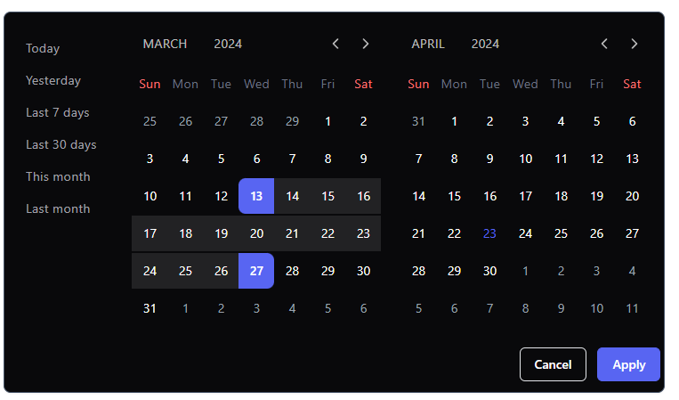

<h1>Teste Técnico Kirvano - Frontend</h1>

Este projeto foi criado com React, Typescript, Tailwind, Storybook e Jest.

<h2>Instalação</h2>

Para instalar as dependências, utilize o seguinte comando:

<pre><code>npm install
</code></pre>

<h2>Execução</h2>

Para iniciar o servidor em modo de desenvolvimento, utilize o comando:

<pre><code>npm run dev
</code></pre>

Para executar os testes, utilize o seguinte comando:

<pre><code>npm run test
</code></pre>

Para abrir o Storybook, utilize o comando:

<pre><code>npm run storybook
</code></pre>
